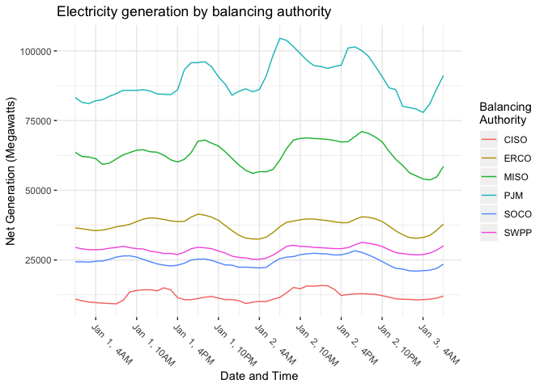
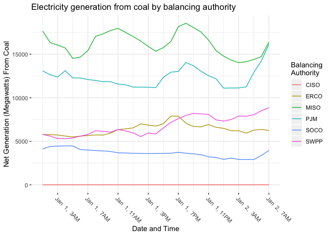
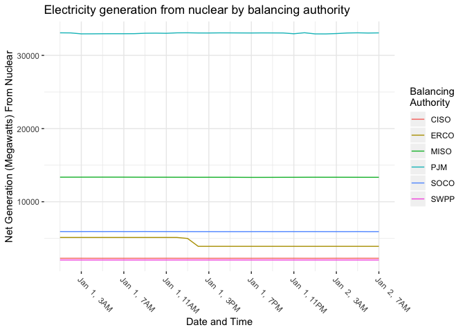
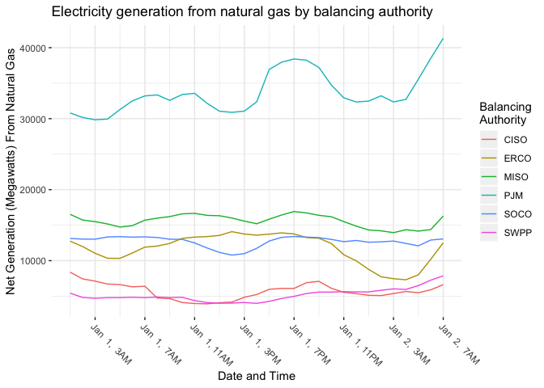
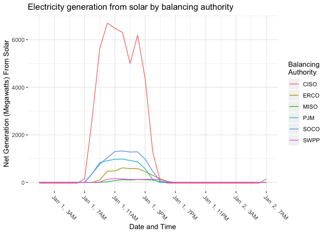
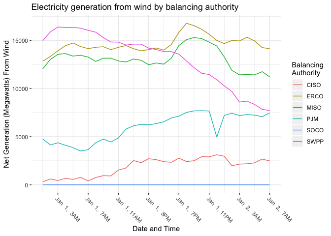
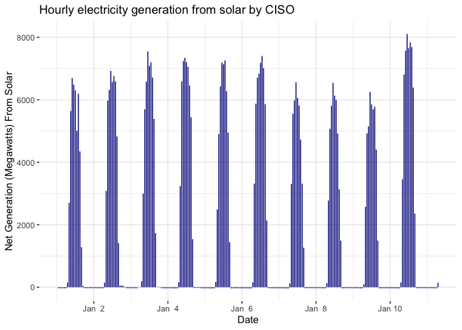
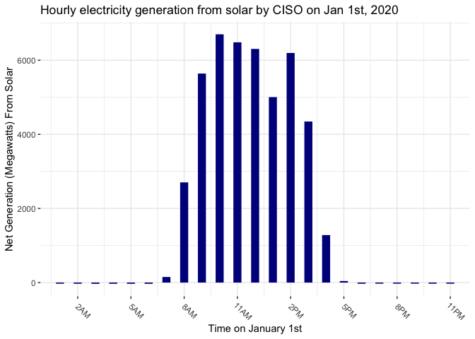
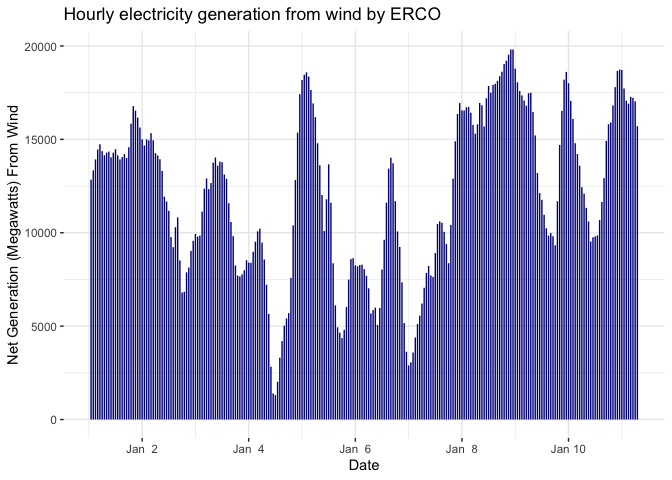
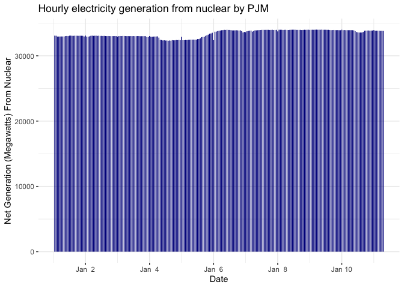

Fine-Grained Energy Demand
================
Avery Rogers
2020-02-17

  - [Energy Demand and Generation at Top Electricity Balancing
    Authorities](#energy-demand-and-generation-at-top-electricity-balancing-authorities)
      - [Tidying the Data](#tidying-the-data)
      - [Net Generation by Balancing
        Authority](#net-generation-by-balancing-authority)
      - [Balancing Authority by Energy
        Source](#balancing-authority-by-energy-source)
          - [Coal](#coal)
          - [Nuclear](#nuclear)
          - [Natural Gas](#natural-gas)
          - [Solar](#solar)
          - [Wind](#wind)
      - [Renewable Energy Reliability Around the
        Clock](#renewable-energy-reliability-around-the-clock)
          - [Solar](#solar-1)
          - [Wind](#wind-1)
          - [Nuclear](#nuclear-1)

``` r
# Libraries
library(tidyverse)
library(lubridate)

# Parameters

  # Day-ahead demand forecast API
balance_data <- ("~/GitHub/EIA930_BALANCE_2020_Jan_Jun.csv")

  # Variable types
vars_types <- 
  cols_only(
    `Balancing Authority` = col_character(),
    `Data Date` = col_character(),
    `Hour Number` = col_character(),
    `Demand Forecast (MW)` = col_character(),
    `Demand (MW)` = col_character(),
    `Net Generation (MW)` = col_character(),
    `Total Interchange (MW)` = col_character(),
    `Net Generation (MW) from Coal` = col_character(),
    `Net Generation (MW) from Natural Gas` = col_character(),
    `Net Generation (MW) from Nuclear` = col_character(),
    `Net Generation (MW) from Solar` = col_character(),
    `Net Generation (MW) from Wind` = col_character()
  )

  # Vector of top balancing authorities
TOP_AUTHORITIES <- c("PJM", "MISO", "SOCO", "ERCO", "SWPP", "CISO")


#===============================================================================

# Code
```

# Energy Demand and Generation at Top Electricity Balancing Authorities

For this portion of my C01, I wanted to explore the different
electricity balancing authorities across the United States and
understand how they generate enrgy on a more granular level, as well as
how they calibrate their forecasts with demand and generation. Here, I
will focus on the 6 largest balancing authorities, which operate most of
the US electricity markets:

  - PJM: Standing for Pennsylvania-New Jersey-Maryland Connection, the
    PJM serves the Mid-Atlantic region and some of the Northeast.
    \*MISO: Stanfind for Midcontinent Independent System Operator, MISO
    serves the upper Midwest and parts of the South.
  - SOCO: Standing for Southern Company Services, SOCO serves the
    majority of the American South.
  - ERCO: Standing for Electric Reliability Council of Texas, ERCO
    serves the state of Texas.
  - SWPP: Standing for Southwest Power Pool, SWPP serves the American
    Southwest.
  - CISO: Standing for California Independent Service Operator, CISO
    serves the state of California.

## Tidying the Data

``` r
balance <- 
  balance_data %>% 
  read_csv(col_types = vars_types) %>% 
  transmute(
    balancing_authority = (`Balancing Authority`),
    datetime = mdy_h(paste(`Data Date`, `Hour Number`)),
    demand_forecast = `Demand Forecast (MW)`,
    demand = `Demand (MW)`,
    net_generation = `Net Generation (MW)`,
    total_interchange = `Total Interchange (MW)`,
    net_gen_coal = `Net Generation (MW) from Coal`,
    net_gen_natgas = `Net Generation (MW) from Natural Gas`,
    net_gen_nuclear = `Net Generation (MW) from Nuclear`,
    net_gen_solar = `Net Generation (MW) from Solar`,
    net_gen_wind = `Net Generation (MW) from Wind`
  ) %>% 
  filter(balancing_authority %in% TOP_AUTHORITIES) %>% 
  mutate_at(vars(demand_forecast:net_gen_wind), ~ as.integer(str_remove(., ",")))
  
balance
```

    ## # A tibble: 6,912 x 11
    ##    balancing_autho… datetime            demand_forecast demand net_generation
    ##    <chr>            <dttm>                        <int>  <int>          <int>
    ##  1 CISO             2020-01-01 01:00:00           21435  21810          11021
    ##  2 CISO             2020-01-01 02:00:00           20588  21049          10378
    ##  3 CISO             2020-01-01 03:00:00           19945  20457           9903
    ##  4 CISO             2020-01-01 04:00:00           19578  20118           9717
    ##  5 CISO             2020-01-01 05:00:00           19557  19971           9525
    ##  6 CISO             2020-01-01 06:00:00           19951  20256           9392
    ##  7 CISO             2020-01-01 07:00:00           20693  20747           9281
    ##  8 CISO             2020-01-01 08:00:00           20511  20729          10524
    ##  9 CISO             2020-01-01 09:00:00           20021  20282          13574
    ## 10 CISO             2020-01-01 10:00:00           19501  19653          14073
    ## # … with 6,902 more rows, and 6 more variables: total_interchange <int>,
    ## #   net_gen_coal <int>, net_gen_natgas <int>, net_gen_nuclear <int>,
    ## #   net_gen_solar <int>, net_gen_wind <int>

## Net Generation by Balancing Authority

Here, I compare the net generation on January 1st and 2nd, 2020 for each
operator.

``` r
balance  %>% 
  filter(datetime < "2020-01-03 0:00:00") %>% 
  ggplot(aes(datetime, net_generation, color = balancing_authority)) + 
  geom_line() +
  scale_x_datetime(date_breaks = "6 hours", date_labels = "%b %e, %l%p") +
  theme(axis.text.x = element_text(angle = -45, hjust = 0)) +
  labs(
    x = "Date and Time",
    y = "Net Generation (Megawatts)",
    title = "Electricity generation by balancing authority",
    color = "Balancing\nAuthority"
  ) +
  theme(
    panel.background = element_rect(fill = "white"),
    panel.grid.major = element_line(color = "grey92"),
    panel.grid.minor = element_line(color = "grey92")
  )
```

<!-- -->

As we can see, PJM is operates the most electricity of all the
authorities, followed by MISO and the rest with significantly less
electricity under their control. All of the authorities see a jump in
generation at about 4PM, as would be expected given that the sun begins
to set at about this time in the winter. It then tapers off as people go
to sleep and spikes again around 5AM, when people begin to rise and
start their days.

## Balancing Authority by Energy Source

Here, I look at each source of energy tracked by the Energy Information
Administration - natural gas, coal, nuclear, solar, and wind, and their
usage levels across the balance authorities.

### Coal

``` r
balance  %>% 
  filter(datetime < "2020-01-02 0:00:00") %>% 
  ggplot(aes(datetime, net_gen_coal, color = balancing_authority)) + 
  geom_line() +
  scale_x_datetime(date_breaks = "4 hours", date_labels = "%b %e, %l%p") +
  theme(axis.text.x = element_text(angle = -45, hjust = 0)) +
  labs(
    x = "Date and Time",
    y = "Net Generation (Megawatts) From Coal",
    title = "Electricity generation from coal by balancing authority",
    color = "Balancing\nAuthority"
  ) +
  theme(
    panel.background = element_rect(fill = "white"),
    panel.grid.major = element_line(color = "grey92"),
    panel.grid.minor = element_line(color = "grey92")
  )
```

<!-- -->

### Nuclear

``` r
balance  %>% 
  filter(datetime < "2020-01-02 0:00:00") %>% 
  ggplot(aes(datetime, net_gen_nuclear, color = balancing_authority)) + 
  geom_line() +
  scale_x_datetime(date_breaks = "4 hours", date_labels = "%b %e, %l%p") +
  theme(axis.text.x = element_text(angle = -45, hjust = 0)) +
  labs(
    x = "Date and Time",
    y = "Net Generation (Megawatts) From Nuclear",
    title = "Electricity generation from nuclear by balancing authority",
    color = "Balancing\nAuthority"
  ) +
  theme(
    panel.background = element_rect(fill = "white"),
    panel.grid.major = element_line(color = "grey92"),
    panel.grid.minor = element_line(color = "grey92")
  )
```

<!-- -->

### Natural Gas

``` r
balance  %>% 
  filter(datetime < "2020-01-02 0:00:00") %>% 
  ggplot(aes(datetime, net_gen_natgas, color = balancing_authority)) + 
  geom_line() +
  scale_x_datetime(date_breaks = "4 hours", date_labels = "%b %e, %l%p") +
  theme(axis.text.x = element_text(angle = -45, hjust = 0)) +
  labs(
    x = "Date and Time",
    y = "Net Generation (Megawatts) From Natural Gas",
    title = "Electricity generation from natural gas by balancing authority",
    color = "Balancing\nAuthority"
  ) +
  theme(
    panel.background = element_rect(fill = "white"),
    panel.grid.major = element_line(color = "grey92"),
    panel.grid.minor = element_line(color = "grey92")
  )
```

<!-- -->

### Solar

``` r
balance  %>% 
  filter(datetime < "2020-01-02 0:00:00") %>% 
  ggplot(aes(datetime, net_gen_solar, color = balancing_authority)) + 
  geom_line() +
  scale_x_datetime(date_breaks = "4 hours", date_labels = "%b %e, %l%p") +
  theme(axis.text.x = element_text(angle = -45, hjust = 0)) +
  labs(
    x = "Date and Time",
    y = "Net Generation (Megawatts) From Solar",
    title = "Electricity generation from solar by balancing authority",
    color = "Balancing\nAuthority"
  ) +
  theme(
    panel.background = element_rect(fill = "white"),
    panel.grid.major = element_line(color = "grey92"),
    panel.grid.minor = element_line(color = "grey92")
  )
```

<!-- -->

### Wind

``` r
balance  %>% 
  filter(datetime < "2020-01-02 0:00:00") %>% 
  ggplot(aes(datetime, net_gen_wind, color = balancing_authority)) + 
  geom_line() +
  scale_x_datetime(date_breaks = "4 hours", date_labels = "%b %e, %l%p") +
  theme(axis.text.x = element_text(angle = -45, hjust = 0)) +
  labs(
    x = "Date and Time",
    y = "Net Generation (Megawatts) From Wind",
    title = "Electricity generation from wind by balancing authority",
    color = "Balancing\nAuthority"
  ) +
  theme(
    panel.background = element_rect(fill = "white"),
    panel.grid.major = element_line(color = "grey92"),
    panel.grid.minor = element_line(color = "grey92")
  )
```

<!-- -->

## Renewable Energy Reliability Around the Clock

For this section, I want to look at wind, solar, and nuclear at the
balancing authorities where they are most common to see how they do as
far as reliability over the course of many days. The patterns that
emerge will be instructive for understanding the possible energy mixes
of a greener future with reliable electricity.

### Solar

``` r
balance  %>% 
  filter(balancing_authority == "CISO") %>% 
  filter(datetime < "2020-01-11 0:00:00") %>% 
  ggplot(aes(datetime, net_gen_solar)) + 
  geom_segment(
    aes(x = datetime, y = 0, xend = datetime, yend = net_gen_solar), 
    color = "darkblue"
  ) +
  scale_x_datetime(date_labels = "%b %e") +
  labs(
    x = "Date",
    y = "Net Generation (Megawatts) From Solar",
    title = "Hourly electricity generation from solar by CISO"
  ) +
  theme(
    panel.background = element_rect(fill = "white"),
    panel.grid.major = element_line(color = "grey92"),
    panel.grid.minor = element_line(color = "grey92")
  )
```

<!-- -->

As we can see, solar has similar peaks in its electricity productivity
each day in California, where sunshine is fairly abundant and regular.
However, as is to be expected, solar capacity drops to zero in the late
hours of the day until the sun is back up. To get a more complete sense
of this picture, let’s zoom in on a day:

``` r
balance  %>% 
  filter(balancing_authority == "CISO") %>% 
  filter(date(datetime) == "2020-01-01") %>% 
  ggplot(aes(datetime, net_gen_solar)) + 
  geom_segment(
    aes(x = datetime, y = 0, xend = datetime, yend = net_gen_solar), 
    color = "darkblue",
    size = 4
  ) +
  scale_x_datetime(breaks = "3 hours") +
  scale_x_datetime(date_breaks = "3 hours", date_labels = "%l%p") +
  theme(axis.text.x = element_text(angle = -45, hjust = 0)) +
  labs(
    x = "Time on January 1st",
    y = "Net Generation (Megawatts) From Solar",
    title = "Hourly electricity generation from solar by CISO on Jan 1st, 2020"
  ) +
  theme(
    panel.background = element_rect(fill = "white"),
    panel.grid.major = element_line(color = "grey92"),
    panel.grid.minor = element_line(color = "grey92")
  )
```

    ## Scale for 'x' is already present. Adding another scale for 'x', which will
    ## replace the existing scale.

<!-- -->

As we see here, solar only generates any electricity from 8AM - 4PM in
the winter in California, with the builk between 9AM and 3PM.

### Wind

``` r
balance  %>% 
  filter(balancing_authority == "ERCO") %>% 
  filter(datetime < "2020-01-11 0:00:00") %>% 
  ggplot(aes(datetime, net_gen_wind)) + 
  geom_segment(
    aes(x = datetime, y = 0, xend = datetime, yend = net_gen_wind), 
    color = "darkblue"
  ) +
  scale_x_datetime(date_labels = "%b %e") +
  labs(
    x = "Date",
    y = "Net Generation (Megawatts) From Wind",
    title = "Hourly electricity generation from wind by ERCO"
  ) +
  theme(
    panel.background = element_rect(fill = "white"),
    panel.grid.major = element_line(color = "grey92"),
    panel.grid.minor = element_line(color = "grey92")
  )
```

<!-- -->

Looking at wind electricity productivity in Texas under ERCO, we see
that its productivity does not have the same daily peaks and falls as
solar energy does in California, but rather has an unpredictable pattern
across days depending on weather conditions.

### Nuclear

``` r
balance  %>% 
  filter(balancing_authority == "PJM") %>% 
  filter(datetime < "2020-01-11 0:00:00") %>% 
  ggplot(aes(datetime, net_gen_nuclear)) + 
  geom_segment(
    aes(x = datetime, y = 0, xend = datetime, yend = net_gen_nuclear), 
    color = "darkblue"
  ) +
  scale_x_datetime(date_labels = "%b %e") +
  labs(
    x = "Date",
    y = "Net Generation (Megawatts) From Nuclear",
    title = "Hourly electricity generation from nuclear by PJM"
  ) +
  theme(
    panel.background = element_rect(fill = "white"),
    panel.grid.major = element_line(color = "grey92"),
    panel.grid.minor = element_line(color = "grey92")
  )
```

<!-- -->

Nuclear, as we see from PJM, is by far the most stable source of
renewable energy documented by the EIA across balance authorities. It
has nearly perfect consistency across all hours of the day, every day of
the week.
