Energy Consumption Sources by State
================
Avery Rogers
2020-03-01

  - [Part I: Energy Consumption for Electricity by State and
    Year](#part-i-energy-consumption-for-electricity-by-state-and-year)
      - [Cleaning Data](#cleaning-data)
      - [Getting percentages by source for each year and
        state](#getting-percentages-by-source-for-each-year-and-state)
      - [Creating necessary plotting
        functions](#creating-necessary-plotting-functions)
      - [Example plot: Alaska](#example-plot-alaska)
      - [Greatest Consumers By
        Fraction](#greatest-consumers-by-fraction)
      - [Example: Wood and Waste 2017](#example-wood-and-waste-2017)
  - [Part II: Energy Usage by
    Population](#part-ii-energy-usage-by-population)
      - [Cleaning Population Data](#cleaning-population-data)
      - [Combining The Tibbles](#combining-the-tibbles)
      - [Total Energy Consumption Per Capita by State over
        Time](#total-energy-consumption-per-capita-by-state-over-time)
      - [Example States](#example-states)
      - [State energy consumption per capita by
        source](#state-energy-consumption-per-capita-by-source)
      - [Example: Maine](#example-maine)
  - [Part III: Energy Demand and Generation at Top Electricity Balancing
    Authorities](#part-iii-energy-demand-and-generation-at-top-electricity-balancing-authorities)
      - [Tidying the Data](#tidying-the-data)
      - [Checking if Demand, Generation, and Interchange Data Add
        Up](#checking-if-demand-generation-and-interchange-data-add-up)
      - [Net Generation by Balancing
        Authority](#net-generation-by-balancing-authority)
      - [Balancing Authority by Energy
        Source](#balancing-authority-by-energy-source)
          - [Coal](#coal)
          - [Nuclear](#nuclear)
          - [Natural Gas](#natural-gas)
          - [Solar](#solar)
          - [Wind](#wind)
      - [Renewable Energy Reliability Around the
        Clock](#renewable-energy-reliability-around-the-clock)
          - [Solar](#solar-1)
          - [Wind](#wind-1)
          - [Nuclear](#nuclear-1)

``` r
# Libraries
library(tidyverse)
library(ggalluvial)
library(lubridate)

# Parameters

  # Energy consumption data from EIA
energy_data <- "~/Downloads/use_all_btu.csv"

  # State population data from FRED
population_data <- "~/Downloads/state_population.csv"

# Day-ahead demand forecast API
balance_data <- ("~/GitHub/EIA930_BALANCE_2020_Jan_Jun.csv")

# MSN codes to keep
msn_to_keep <- 
  c(
    "CLTCB", 
    "GETCB", 
    "HYTCB", 
    "NGTCB", 
    "NUETB", 
    "SOTCB", 
    "WWTCB",
    "WYTCB"
  )

# Recode MSN values
recode_msn <- 
  c(
    "CLTCB" = "Coal",
    "GETCB" = "Geothermal",
    "HYTCB" =  "Hydropower",
    "NGTCB" = "Natural Gas", 
    "NUETB" = "Nuclear", 
    "SOTCB" = "Solar",
    "WWTCB" = "Wood and Waste", 
    "WYTCB" = "Wind"
  ) 

  # Variable types for balancing authority data
vars_types <- 
  cols_only(
    `Balancing Authority` = col_character(),
    `Data Date` = col_character(),
    `Hour Number` = col_character(),
    `Demand Forecast (MW)` = col_character(),
    `Demand (MW)` = col_character(),
    `Net Generation (MW)` = col_character(),
    `Total Interchange (MW)` = col_character(),
    `Net Generation (MW) from Coal` = col_character(),
    `Net Generation (MW) from Natural Gas` = col_character(),
    `Net Generation (MW) from Nuclear` = col_character(),
    `Net Generation (MW) from Solar` = col_character(),
    `Net Generation (MW) from Wind` = col_character()
  )

# Vector of top balancing authorities
TOP_AUTHORITIES <- c("PJM", "MISO", "SOCO", "ERCO", "SWPP", "CISO")

#===============================================================================
```

# Part I: Energy Consumption for Electricity by State and Year

In this section, I am only looking at the sources of energy that
primarily contribute to electricity generation across states: coal,
geothermal power, hydropower, natural gas, nuclear power, solar power,
wood and waste power, and wind power. I remove all the other energy
usage statistics from the dataset to hone in on these. Most notably, I
remove petroleum, which is the largest source of energy in many states
but primarily for transportation rather than electriticy in the grid.

An important note about this data: all energy usage is measured in BTU,
or British Thermal Units. One BTU is the amount of energy needed to
raise one pound of water by one degree Fahrenheit. (I’m not sure why
it’s called *British* thermal units if the measurements it uses are
imperial\!). One BTU is approximately 1,055 joules. BTU is the unit used
to sell natural gas in the US (dollars per million BTUs), and is the
best unit of measurement for comparing different energy sources.

## Cleaning Data

``` r
energy_data_clean <- 
  read_csv(energy_data) %>% 
  rename_all(str_to_lower) %>% 
  select(-data_status) %>% 
  pivot_longer(c("1960":"2017"), names_to = "year", values_to = "amount") %>% 
  mutate(year = as.integer(year)) %>% 
  select(state, year, msn, amount) %>% 
  filter(msn %in% msn_to_keep) %>% 
  mutate_at(vars(msn), recode, !!! recode_msn) %>% 
  mutate(amount = replace_na(amount, 0))
```

    ## Parsed with column specification:
    ## cols(
    ##   .default = col_double(),
    ##   Data_Status = col_character(),
    ##   State = col_character(),
    ##   MSN = col_character()
    ## )

    ## See spec(...) for full column specifications.

``` r
energy_data_clean
```

    ## # A tibble: 24,128 x 4
    ##    state  year msn   amount
    ##    <chr> <int> <chr>  <dbl>
    ##  1 AK     1960 Coal    7189
    ##  2 AK     1961 Coal   11552
    ##  3 AK     1962 Coal   13559
    ##  4 AK     1963 Coal   11999
    ##  5 AK     1964 Coal   12029
    ##  6 AK     1965 Coal    9888
    ##  7 AK     1966 Coal   16431
    ##  8 AK     1967 Coal   18462
    ##  9 AK     1968 Coal   15998
    ## 10 AK     1969 Coal   13191
    ## # … with 24,118 more rows

## Getting percentages by source for each year and state

``` r
consumption_fractions <- 
  energy_data_clean %>% 
  group_by(state, year) %>% 
  mutate(total_cons = sum(amount)) %>% 
  ungroup() %>% 
  mutate(frac_amount = amount / total_cons) %>% 
  select(state, year, msn, frac_amount)

consumption_fractions
```

    ## # A tibble: 24,128 x 4
    ##    state  year msn   frac_amount
    ##    <chr> <int> <chr>       <dbl>
    ##  1 AK     1960 Coal        0.449
    ##  2 AK     1961 Coal        0.546
    ##  3 AK     1962 Coal        0.541
    ##  4 AK     1963 Coal        0.473
    ##  5 AK     1964 Coal        0.447
    ##  6 AK     1965 Coal        0.379
    ##  7 AK     1966 Coal        0.444
    ##  8 AK     1967 Coal        0.476
    ##  9 AK     1968 Coal        0.380
    ## 10 AK     1969 Coal        0.204
    ## # … with 24,118 more rows

## Creating necessary plotting functions

``` r
plot_fractions <- function(state_abbv, state) {
  consumption_fractions %>% 
    filter(state == state_abbv) %>% 
    ggplot(aes(x = year, y = frac_amount, alluvium = msn)) + 
    geom_alluvium(
      aes(fill = msn, color = msn), 
      width = 1/16, 
      alpha = 1/2, 
      decreasing = NA
    ) + 
    scale_x_continuous(
      breaks = seq(1960, 2015, 5),
      expand = c(0, 0)
    ) +
    scale_y_continuous(
      expand = c(0, 0),
      breaks = seq(0, 1, 0.1),
      minor_breaks = NULL,
      labels = scales::percent_format(accuracy = 1)
    ) +
    labs(
      x = "Year",
      y = "Percentage of Energy Consumption",
      title = str_glue("Energy Consumption by Source in {state}, Percentage"),
      caption = "Source: US Energy Information Administration",
      color = "Energy\nSource",
      fill = "Energy\nSource"
    ) +
    theme(
      panel.background = element_rect(fill = "grey95"),
      panel.grid.major = element_line(color = "white"),
      panel.grid.minor = element_line(color = "white")
    )
} 

plot_amount <- function(state_abbv, state) {
  energy_data_clean %>% 
    filter(state == state_abbv) %>% 
    ggplot(aes(x = year, y = amount, alluvium = msn)) + 
    geom_alluvium(
      aes(fill = msn, color = msn), 
      width = 1/16, 
      alpha = 1/2, 
      decreasing = NA
    ) + 
    scale_x_continuous(
      breaks = seq(1960, 2015, 5),
      expand = c(0, 0)
    ) +
    scale_y_continuous(
      expand = c(0, 0),
      labels = scales::number_format(accuracy = 1)
    ) +
    labs(
      x = "Year",
      y = "Amount (billion BTU)" ,
      title = str_glue("Energy Consumption by Source in {state}, Total Amount"),
      caption = "Source: US Energy Information Administration",
      color = "Energy\nSource",
      fill = "Energy\nSource"
    ) +
    theme(
      panel.background = element_rect(fill = "white"),
      panel.grid.major = element_line(color = "gray92"),
      panel.grid.minor = element_line(color = "gray92")
    )
}
```

## Example plot: Alaska

The Alaska plots demonstrate why it is interesting and important to plot
not only the percentages of electricity-generating energy sources by
year, but also the total amount of electricity-generating enegy sources
by year. As we can see in the first plot, Alaska repidly transitions
from minimal to very high usage of natural gas in the 1960s and 70s as a
percentage of its energy sources. Looking at the second plot, we see a
more nuanced story: it was not that Alaska used large amount of coal in
the 1960s, but rather that their energy usage overall more than doubled
from 1960 to 1970, and continued to grow rapidly in the decades
afterwards.

``` r
plot_fractions("AK", "Alaska")
```

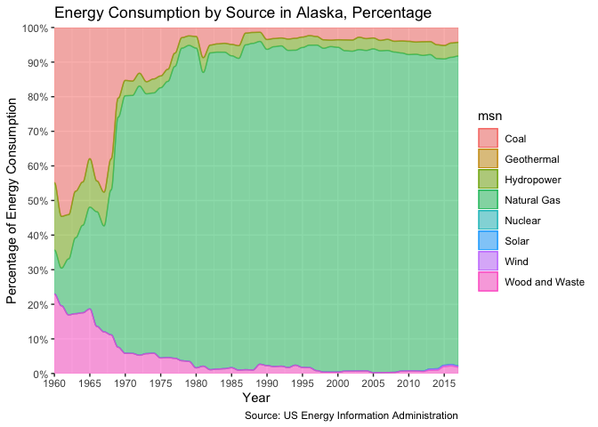<!-- -->

``` r
plot_amount("AK", "Alaska")
```

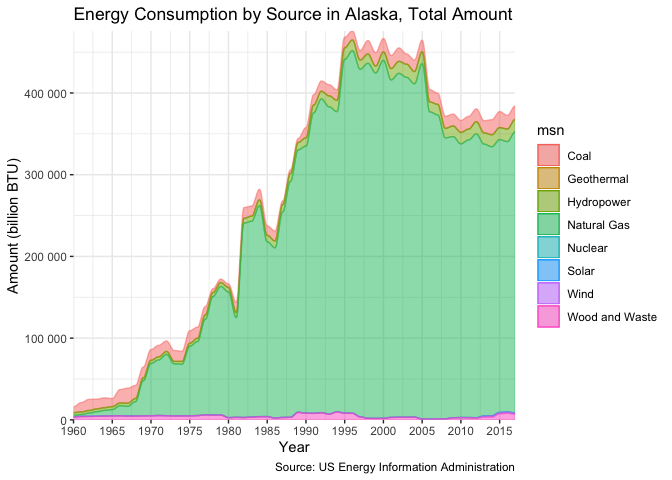<!-- -->

## Greatest Consumers By Fraction

``` r
greatest_consumer <- function(target_msn, target_year) {
  consumption_fractions %>% 
    filter(msn == target_msn, year == target_year) %>% 
    mutate(state = fct_reorder(state, frac_amount)) %>%
    ggplot(aes(state, frac_amount)) + 
    geom_point() +
    coord_flip() +
    scale_y_continuous(
      labels = scales::percent_format(accuracy = 1)
    ) +
    labs(
      x = "State",
      y = str_glue("Percentage of Energy Consumption from {target_msn}"), 
      title = str_glue(
        "Comparative Energy Consumption from {target_msn} in {target_year}",
      caption = "Source: US Energy Information Administration"
      )
    ) +
    theme(
      panel.background = element_rect(fill = "grey98"),
      panel.grid.major = element_line(color = "grey92"),
      panel.grid.minor = element_line(color = "grey92")
    )
} 
```

## Example: Wood and Waste 2017

The northeastern states of Maine, New Hampshire, and Vermont consume a
large fraction of energy sourced from wood and waste as of 2017. Who
knew\!

``` r
greatest_consumer("Wood and Waste", 2017)
```

<!-- -->

# Part II: Energy Usage by Population

In this section, I wanted to understand the relationship between energy
usage and state population and see whether increases in energy usage
were accelerating faster or slower than overall population growth by
state. This will help shed more light on how energy consumption is
changing per capita and whether or not we are headed in the right
direction in terms of sustainability.

## Cleaning Population Data

``` r
population_data_clean <- 
  read_csv(population_data) %>% 
  pivot_longer(
    cols = c(AKPOP:WYPOP), 
    names_to = "state", 
    values_to = "population"
  ) %>% 
  mutate_at(vars(state), ~ str_sub(., 1, 2)) %>% 
  mutate(
    year = as.integer(year(DATE)),
    population_thousands = as.integer(population)
  ) %>% 
  select(year, state, population_thousands) %>% 
  filter(year > 1959, year < 2018)
```

    ## Parsed with column specification:
    ## cols(
    ##   .default = col_double(),
    ##   DATE = col_date(format = "")
    ## )

    ## See spec(...) for full column specifications.

``` r
population_data_clean
```

    ## # A tibble: 2,958 x 3
    ##     year state population_thousands
    ##    <int> <chr>                <int>
    ##  1  1960 AK                     229
    ##  2  1960 AL                    3274
    ##  3  1960 AR                    1789
    ##  4  1960 AZ                    1321
    ##  5  1960 CA                   15870
    ##  6  1960 CO                    1769
    ##  7  1960 CT                    2544
    ##  8  1960 DC                     765
    ##  9  1960 DE                     449
    ## 10  1960 FL                    5004
    ## # … with 2,948 more rows

## Combining The Tibbles

Here, I add a variable `amount_per_capita` to see how much energy is
being used per each 1,000 people in the state.

``` r
total_energy_population <- 
  energy_data_clean %>% 
  left_join(population_data_clean, by = c("year", "state")) %>% 
  mutate(amount_per_capita = amount / population_thousands)

fraction_energy_population <- 
  consumption_fractions %>% 
  left_join(population_data_clean, by = c("year", "state"))
```

## Total Energy Consumption Per Capita by State over Time

When comparatively plotting the total energy consumption per 1,000
people by state over time, we see very surprising results: some states
are using as much as 3x the amount of energy per capita as others.

``` r
per_capita_energy <- function(state_abbv) { 
  total_energy_population %>% 
    filter(state %in% state_abbv) %>% 
    count(state, year, wt = amount_per_capita) %>% 
    ggplot(aes(year, n, color = state)) +
    geom_line() +
    scale_x_continuous(
      breaks = seq(1960, 2020, 5), 
      expand = c(0, 0)
    ) +
    labs(
      x = "Year", 
      y = "Total Energy Consumption in BTUs per 1,000 People",
      title = "Comparing total energy use per capita in US states",
      color = "State",
      caption = "Sources: St. Louis Fred, US Energy Information Administration"
    ) +
    theme(
      panel.background = element_rect(fill = "white"),
      panel.grid.major = element_line(color = "grey92"),
      panel.grid.minor = element_line(color = "grey92")
    )
}
```

## Example States

As we can see, variation among states’ per-capita energy consumption is
high, with a state like Kentucky consuming nearly three times as many
BTUs of energy per 1,000 people as California.

``` r
per_capita_energy(c("FL", "CA", "CT", "CO", "PA", "KY"))
```

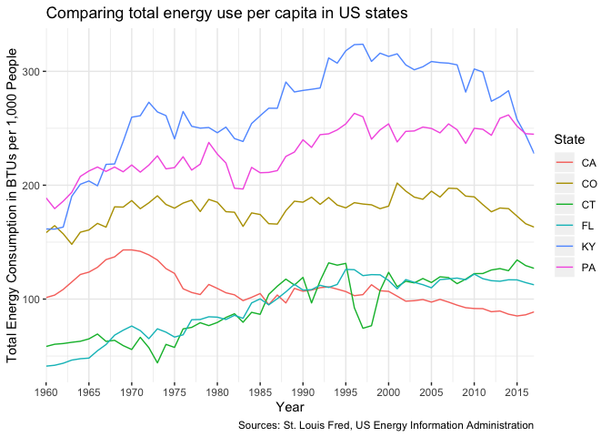<!-- -->

## State energy consumption per capita by source

Here, I look at at comparing the use of different energy sources per
1,000 people within a state. It’s particularly interesting to see how
sources have substituted over time, and whether or not the overall trend
is increasing or decreasing. This supplements the total usage by source
graphs above by paying closer attention to the usage standardized for
population changes.

``` r
per_capita_compare <- function(state_abbv, state, msn_vars) {
  total_energy_population %>% 
  filter(state == state_abbv, msn %in% msn_vars) %>% 
  ggplot(aes(year, amount_per_capita, color = msn)) +
  geom_line() +
  scale_x_continuous(
    breaks = seq(1960, 2020, 5), 
    expand = c(0, 0)
  ) +
  scale_y_continuous(expand = c(0, 0)) + 
  labs(
    x = "Year", 
    y = "Total Energy Consumption per 1,000 People (BTUs)",
    title = str_glue("{state} energy use per capita by energy source"),
    color = "Energy\nSource",
    caption = "Sources: St. Louis FRED, US Energy Information Administration"
  ) +
  theme(
    panel.background = element_rect(fill = "white"),
    panel.grid.major = element_line(color = "grey92"),
    panel.grid.minor = element_line(color = "grey92")
  )
}
```

## Example: Maine

We see a sudden spike in natural gas consumption per capita in Maine
that trails off after its peak. Hydropower and wood and waste power stay
relatively constant after 1980.

``` r
per_capita_compare(
  "ME", 
  "Maine", 
  c("Coal", "Natural Gas", "Wood and Waste", "Hydropower")
)
```

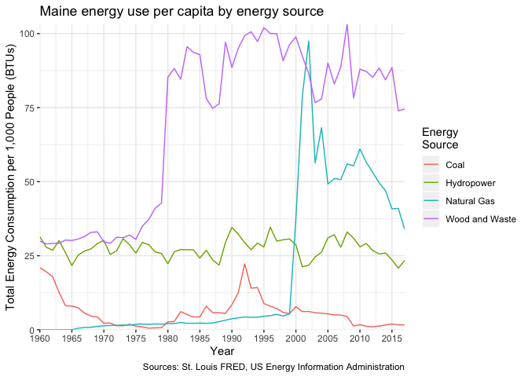<!-- -->

# Part III: Energy Demand and Generation at Top Electricity Balancing Authorities

For this portion of my C01, I wanted to explore the different
electricity balancing authorities across the United States and
understand how they generate enrgy on a more granular level, as well as
how they calibrate their forecasts with demand and generation. Here, I
will focus on the 6 largest balancing authorities, which operate most of
the US electricity markets:

  - PJM: Standing for Pennsylvania-New Jersey-Maryland Connection, the
    PJM serves the Mid-Atlantic region and some of the Northeast.
    \*MISO: Stanfind for Midcontinent Independent System Operator, MISO
    serves the upper Midwest and parts of the South.
  - SOCO: Standing for Southern Company Services, SOCO serves the
    majority of the American South.
  - ERCO: Standing for Electric Reliability Council of Texas, ERCO
    serves the state of Texas.
  - SWPP: Standing for Southwest Power Pool, SWPP serves the American
    Southwest.
  - CISO: Standing for California Independent Service Operator, CISO
    serves the state of California.

## Tidying the Data

``` r
balance <- 
  balance_data %>% 
  read_csv(col_types = vars_types) %>% 
  transmute(
    balancing_authority = (`Balancing Authority`),
    datetime = mdy_h(paste(`Data Date`, `Hour Number`)),
    demand_forecast = `Demand Forecast (MW)`,
    demand = `Demand (MW)`,
    net_generation = `Net Generation (MW)`,
    total_interchange = `Total Interchange (MW)`,
    net_gen_coal = `Net Generation (MW) from Coal`,
    net_gen_natgas = `Net Generation (MW) from Natural Gas`,
    net_gen_nuclear = `Net Generation (MW) from Nuclear`,
    net_gen_solar = `Net Generation (MW) from Solar`,
    net_gen_wind = `Net Generation (MW) from Wind`
  ) %>% 
  filter(balancing_authority %in% TOP_AUTHORITIES) %>% 
  mutate_at(vars(demand_forecast:net_gen_wind), ~ as.integer(str_remove(., ",")))
  
balance
```

    ## # A tibble: 6,912 x 11
    ##    balancing_autho… datetime            demand_forecast demand net_generation
    ##    <chr>            <dttm>                        <int>  <int>          <int>
    ##  1 CISO             2020-01-01 01:00:00           21435  21810          11021
    ##  2 CISO             2020-01-01 02:00:00           20588  21049          10378
    ##  3 CISO             2020-01-01 03:00:00           19945  20457           9903
    ##  4 CISO             2020-01-01 04:00:00           19578  20118           9717
    ##  5 CISO             2020-01-01 05:00:00           19557  19971           9525
    ##  6 CISO             2020-01-01 06:00:00           19951  20256           9392
    ##  7 CISO             2020-01-01 07:00:00           20693  20747           9281
    ##  8 CISO             2020-01-01 08:00:00           20511  20729          10524
    ##  9 CISO             2020-01-01 09:00:00           20021  20282          13574
    ## 10 CISO             2020-01-01 10:00:00           19501  19653          14073
    ## # … with 6,902 more rows, and 6 more variables: total_interchange <int>,
    ## #   net_gen_coal <int>, net_gen_natgas <int>, net_gen_nuclear <int>,
    ## #   net_gen_solar <int>, net_gen_wind <int>

## Checking if Demand, Generation, and Interchange Data Add Up

``` r
balance %>% 
  filter(demand != net_generation - total_interchange)
```

    ## # A tibble: 4,173 x 11
    ##    balancing_autho… datetime            demand_forecast demand net_generation
    ##    <chr>            <dttm>                        <int>  <int>          <int>
    ##  1 CISO             2020-01-01 01:00:00           21435  21810          11021
    ##  2 CISO             2020-01-01 02:00:00           20588  21049          10378
    ##  3 CISO             2020-01-01 03:00:00           19945  20457           9903
    ##  4 CISO             2020-01-01 04:00:00           19578  20118           9717
    ##  5 CISO             2020-01-01 05:00:00           19557  19971           9525
    ##  6 CISO             2020-01-01 06:00:00           19951  20256           9392
    ##  7 CISO             2020-01-01 07:00:00           20693  20747           9281
    ##  8 CISO             2020-01-01 08:00:00           20511  20729          10524
    ##  9 CISO             2020-01-01 09:00:00           20021  20282          13574
    ## 10 CISO             2020-01-01 10:00:00           19501  19653          14073
    ## # … with 4,163 more rows, and 6 more variables: total_interchange <int>,
    ## #   net_gen_coal <int>, net_gen_natgas <int>, net_gen_nuclear <int>,
    ## #   net_gen_solar <int>, net_gen_wind <int>

``` r
balance %>% 
  mutate(difference = demand - net_generation + total_interchange) %>% 
  select(difference) %>%
  summary
```

    ##    difference     
    ##  Min.   :-8629.0  
    ##  1st Qu.:   -1.0  
    ##  Median :    0.0  
    ##  Mean   :  327.4  
    ##  3rd Qu.:  500.0  
    ##  Max.   :13612.0  
    ##  NA's   :171

We can see here that 4,173 of the 6,912 entries in our data do not have
net generation minus total interchange equal to demand. In other words,
most of our entries do not have balanced energy production and energy
consumption. Looking more closely at the distribution of these values,
we see that the median difference between generation and consumption is
0, though the mean is 327 MW. Stunningly, the minimum difference is
-8,629 MW, and the maximum is 13,612 MW. This isn’t great news for our
analysis. Let’s see if there are any particular facilities that aren’t
adding up:

``` r
balance %>% 
  filter(demand != net_generation - total_interchange) %>% 
  count(balancing_authority)
```

    ## # A tibble: 6 x 2
    ##   balancing_authority     n
    ##   <chr>               <int>
    ## 1 CISO                 1103
    ## 2 ERCO                  543
    ## 3 MISO                 1126
    ## 4 PJM                  1128
    ## 5 SOCO                    4
    ## 6 SWPP                  269

It looks like CISO, MISO, and PJM have the most errors, with ERCO and
SWPP following. SOCO has almost no errors in its reporting.
Unfortunately, the EIA website does not offer much guidance on these
errors. They provide a disclaimer at the bottom of their balancing
authority data that “The information submitted by reporting entities is
preliminary data and is made available”as-is" by EIA. Neither EIA nor
reporting entities are responsible for reliance on the data for any
specific use."

## Net Generation by Balancing Authority

Here, I compare the net generation in January, 2020 for each operator.

``` r
balance  %>% 
  filter(month(datetime) == 1) %>% 
  group_by(balancing_authority) %>% 
  summarize(
    total_gen_jan = sum(net_generation, na.rm = TRUE),
    total_demand_jan = sum(demand, na.rm = TRUE)
  ) %>% 
  pivot_longer(
    cols = c(total_gen_jan, total_demand_jan), 
    names_to = "type_use", 
    values_to = "megawatts"
  ) %>% 
  ggplot(aes(fct_rev(fct_reorder(balancing_authority, megawatts)), megawatts, fill = type_use)) + 
  geom_col(position = "dodge") +
  scale_fill_manual(
    labels = c("Demand", "Net Generation"), 
    values = c("brown1", "skyblue")
  ) +
  labs(
    x = "Balancing Authority",
    y = "Total Generation in January (MW)",
    title = "Generation Levels by Balancing Authority",
    fill = "Energy Information\nType"
  )
```

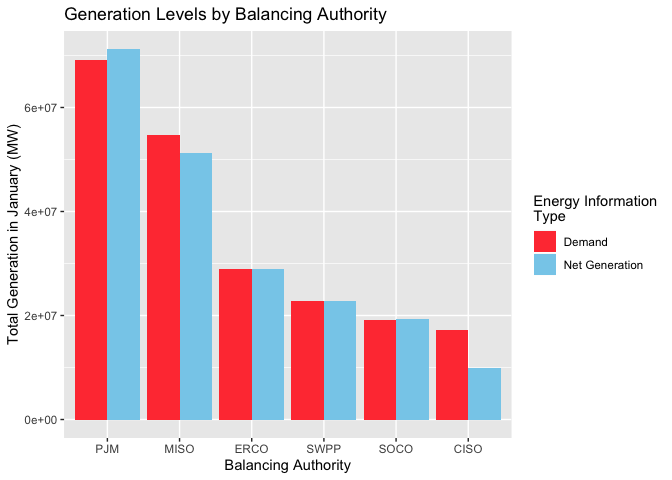<!-- -->

As we can see, PJM is operates the most electricity of all the
authorities, followed by MISO and the rest with significantly less
electricity under their control. Interestingly, PJM is the only
authority that produced more energy in Jan 2020 than it used, ERCO,
SWPP, and SOCO were approximately balanced in generation and demand, and
MISO and CISO’s residents demanded more than the authorities generated
in this period.

## Balancing Authority by Energy Source

Here, I look at each source of energy tracked by the Energy Information
Administration - natural gas, coal, nuclear, solar, and wind, and their
usage levels across the balance authorities.

### Coal

``` r
balance  %>% 
  filter(datetime < "2020-01-02 0:00:00") %>% 
  ggplot(aes(datetime, net_gen_coal, color = balancing_authority)) + 
  geom_line() +
  scale_x_datetime(date_breaks = "4 hours", date_labels = "%b %e, %l%p") +
  theme(axis.text.x = element_text(angle = -45, hjust = 0)) +
  labs(
    x = "Date and Time",
    y = "Net Generation (Megawatts) From Coal",
    title = "Electricity generation from coal by balancing authority",
    color = "Balancing\nAuthority"
  ) +
  theme(
    panel.background = element_rect(fill = "white"),
    panel.grid.major = element_line(color = "grey92"),
    panel.grid.minor = element_line(color = "grey92")
  )
```

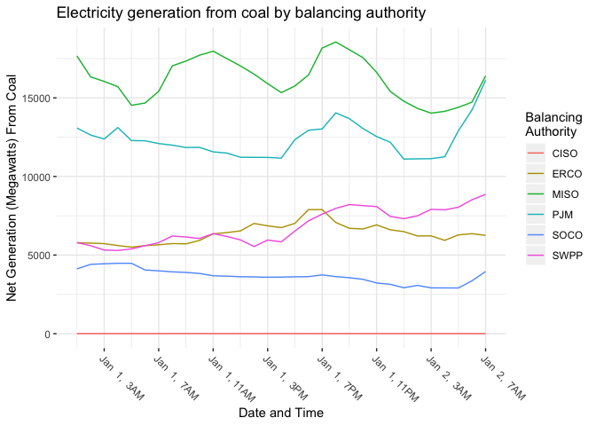<!-- -->

### Nuclear

``` r
balance  %>% 
  filter(datetime < "2020-01-02 0:00:00") %>% 
  ggplot(aes(datetime, net_gen_nuclear, color = balancing_authority)) + 
  geom_line() +
  scale_x_datetime(date_breaks = "4 hours", date_labels = "%b %e, %l%p") +
  theme(axis.text.x = element_text(angle = -45, hjust = 0)) +
  labs(
    x = "Date and Time",
    y = "Net Generation (Megawatts) From Nuclear",
    title = "Electricity generation from nuclear by balancing authority",
    color = "Balancing\nAuthority"
  ) +
  theme(
    panel.background = element_rect(fill = "white"),
    panel.grid.major = element_line(color = "grey92"),
    panel.grid.minor = element_line(color = "grey92")
  )
```

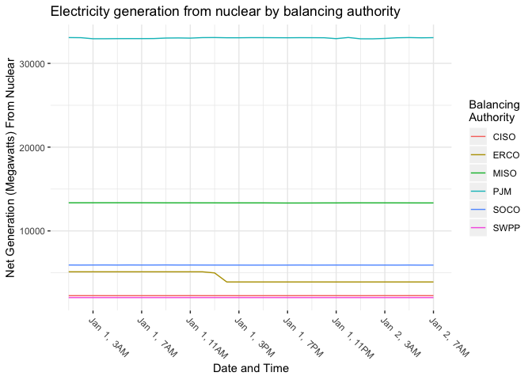<!-- -->

### Natural Gas

``` r
balance  %>% 
  filter(datetime < "2020-01-02 0:00:00") %>% 
  ggplot(aes(datetime, net_gen_natgas, color = balancing_authority)) + 
  geom_line() +
  scale_x_datetime(date_breaks = "4 hours", date_labels = "%b %e, %l%p") +
  theme(axis.text.x = element_text(angle = -45, hjust = 0)) +
  labs(
    x = "Date and Time",
    y = "Net Generation (Megawatts) From Natural Gas",
    title = "Electricity generation from natural gas by balancing authority",
    color = "Balancing\nAuthority"
  ) +
  theme(
    panel.background = element_rect(fill = "white"),
    panel.grid.major = element_line(color = "grey92"),
    panel.grid.minor = element_line(color = "grey92")
  )
```

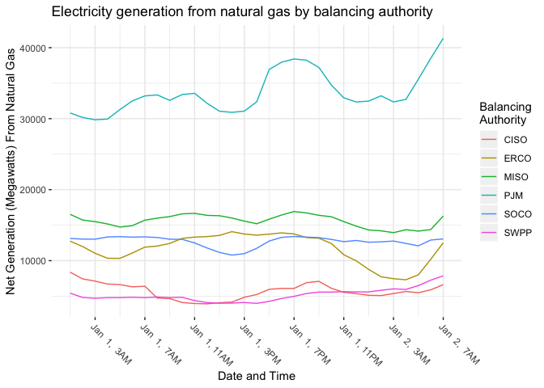<!-- -->

### Solar

``` r
balance  %>% 
  filter(datetime < "2020-01-02 0:00:00") %>% 
  ggplot(aes(datetime, net_gen_solar, color = balancing_authority)) + 
  geom_line() +
  scale_x_datetime(date_breaks = "4 hours", date_labels = "%b %e, %l%p") +
  theme(axis.text.x = element_text(angle = -45, hjust = 0)) +
  labs(
    x = "Date and Time",
    y = "Net Generation (Megawatts) From Solar",
    title = "Electricity generation from solar by balancing authority",
    color = "Balancing\nAuthority"
  ) +
  theme(
    panel.background = element_rect(fill = "white"),
    panel.grid.major = element_line(color = "grey92"),
    panel.grid.minor = element_line(color = "grey92")
  )
```

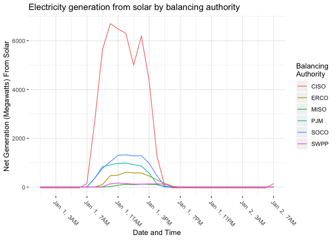<!-- -->

### Wind

``` r
balance  %>% 
  filter(datetime < "2020-01-02 0:00:00") %>% 
  ggplot(aes(datetime, net_gen_wind, color = balancing_authority)) + 
  geom_line() +
  scale_x_datetime(date_breaks = "4 hours", date_labels = "%b %e, %l%p") +
  theme(axis.text.x = element_text(angle = -45, hjust = 0)) +
  labs(
    x = "Date and Time",
    y = "Net Generation (Megawatts) From Wind",
    title = "Electricity generation from wind by balancing authority",
    color = "Balancing\nAuthority"
  ) +
  theme(
    panel.background = element_rect(fill = "white"),
    panel.grid.major = element_line(color = "grey92"),
    panel.grid.minor = element_line(color = "grey92")
  )
```

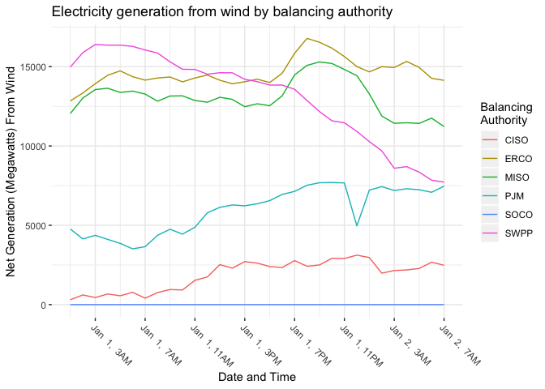<!-- -->

## Renewable Energy Reliability Around the Clock

For this section, I want to look at wind, solar, and nuclear at the
balancing authorities where they are most common to see how they do as
far as reliability over the course of many days. The patterns that
emerge will be instructive for understanding the possible energy mixes
of a greener future with reliable electricity.

### Solar

``` r
balance  %>% 
  filter(balancing_authority == "CISO") %>% 
  filter(datetime < "2020-01-11 0:00:00") %>% 
  ggplot(aes(datetime, net_gen_solar)) + 
  geom_segment(
    aes(x = datetime, y = 0, xend = datetime, yend = net_gen_solar), 
    color = "darkblue"
  ) +
  scale_x_datetime(date_labels = "%b %e") +
  labs(
    x = "Date",
    y = "Net Generation (Megawatts) From Solar",
    title = "Hourly electricity generation from solar by CISO"
  ) +
  theme(
    panel.background = element_rect(fill = "white"),
    panel.grid.major = element_line(color = "grey92"),
    panel.grid.minor = element_line(color = "grey92")
  )
```

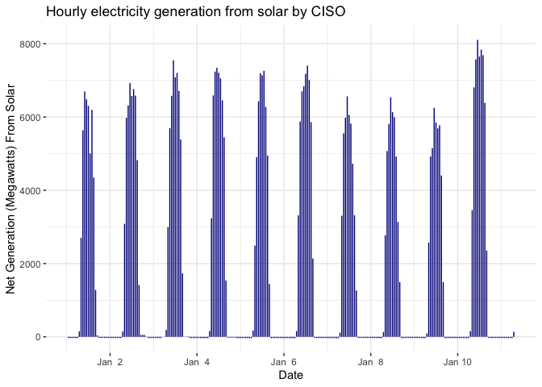<!-- -->

As we can see, solar has similar peaks in its electricity productivity
each day in California, where sunshine is fairly abundant and regular.
However, as is to be expected, solar capacity drops to zero in the late
hours of the day until the sun is back up. To get a more complete sense
of this picture, let’s zoom in on a day:

``` r
balance  %>% 
  filter(balancing_authority == "CISO") %>% 
  filter(date(datetime) == "2020-01-01") %>% 
  ggplot(aes(datetime, net_gen_solar)) + 
  geom_segment(
    aes(x = datetime, y = 0, xend = datetime, yend = net_gen_solar), 
    color = "darkblue",
    size = 4
  ) +
  scale_x_datetime(breaks = "3 hours") +
  scale_x_datetime(date_breaks = "3 hours", date_labels = "%l%p") +
  theme(axis.text.x = element_text(angle = -45, hjust = 0)) +
  labs(
    x = "Time on January 1st",
    y = "Net Generation (Megawatts) From Solar",
    title = "Hourly electricity generation from solar by CISO on Jan 1st, 2020"
  ) +
  theme(
    panel.background = element_rect(fill = "white"),
    panel.grid.major = element_line(color = "grey92"),
    panel.grid.minor = element_line(color = "grey92")
  )
```

    ## Scale for 'x' is already present. Adding another scale for 'x', which will
    ## replace the existing scale.

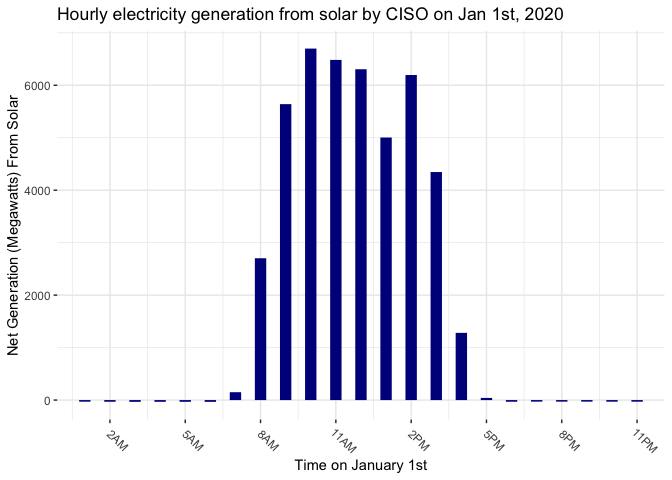<!-- -->

As we see here, solar only generates any electricity from 8AM - 4PM in
the winter in California, with the builk between 9AM and 3PM.

### Wind

``` r
balance  %>% 
  filter(balancing_authority == "ERCO") %>% 
  filter(datetime < "2020-01-11 0:00:00") %>% 
  ggplot(aes(datetime, net_gen_wind)) + 
  geom_segment(
    aes(x = datetime, y = 0, xend = datetime, yend = net_gen_wind), 
    color = "darkblue"
  ) +
  scale_x_datetime(date_labels = "%b %e") +
  labs(
    x = "Date",
    y = "Net Generation (Megawatts) From Wind",
    title = "Hourly electricity generation from wind by ERCO"
  ) +
  theme(
    panel.background = element_rect(fill = "white"),
    panel.grid.major = element_line(color = "grey92"),
    panel.grid.minor = element_line(color = "grey92")
  )
```

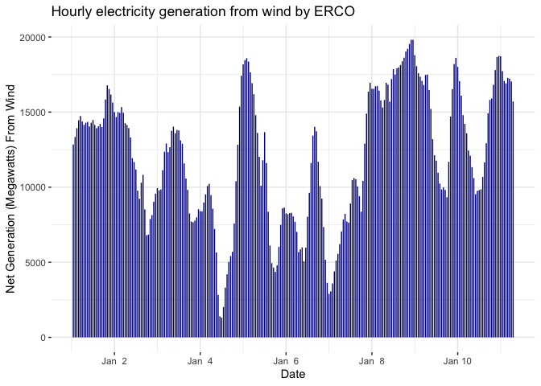<!-- -->

Looking at wind electricity productivity in Texas under ERCO, we see
that its productivity does not have the same daily peaks and falls as
solar energy does in California, but rather has an unpredictable pattern
across days depending on weather conditions.

### Nuclear

``` r
balance  %>% 
  filter(balancing_authority == "PJM") %>% 
  filter(datetime < "2020-01-11 0:00:00") %>% 
  ggplot(aes(datetime, net_gen_nuclear)) + 
  geom_segment(
    aes(x = datetime, y = 0, xend = datetime, yend = net_gen_nuclear), 
    color = "darkblue"
  ) +
  scale_x_datetime(date_labels = "%b %e") +
  labs(
    x = "Date",
    y = "Net Generation (Megawatts) From Nuclear",
    title = "Hourly electricity generation from nuclear by PJM"
  ) +
  theme(
    panel.background = element_rect(fill = "white"),
    panel.grid.major = element_line(color = "grey92"),
    panel.grid.minor = element_line(color = "grey92")
  )
```

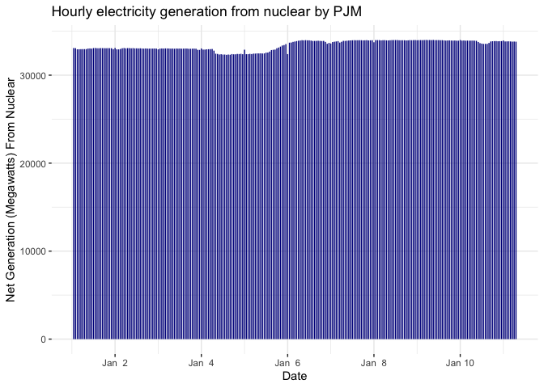<!-- -->

Nuclear, as we see from PJM, is by far the most stable source of
renewable energy documented by the EIA across balance authorities. It
has nearly perfect consistency across all hours of the day, every day of
the week.
