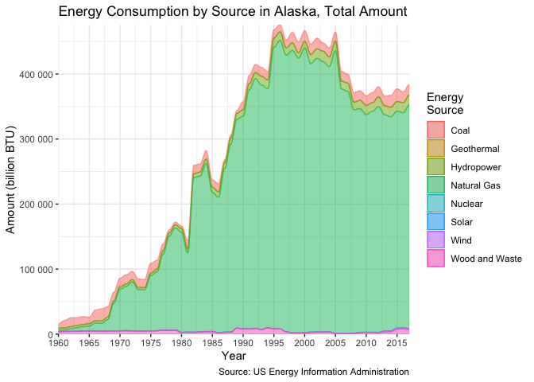

Energy Consumption Sources by State
================
Avery Rogers
2020-02-02

  - [Cleaning Data](#cleaning-data)
  - [Getting Fractions for each year and
    state](#getting-fractions-for-each-year-and-state)
  - [Creating necessary plotting
    functions](#creating-necessary-plotting-functions)
  - [Greatest Consumers By Fraction](#greatest-consumers-by-fraction)

``` r
# Libraries
library(tidyverse)
library(ggalluvial)

# Parameters

energy_data <- read_rds("/Users/averyrogers/GitHub/c01-energy/data/energy_consumption.rds")

#===============================================================================
```

## Cleaning Data

``` r
energy_data_clean <- 
  energy_data %>% 
  select(-data_status) %>% 
  pivot_longer(c("1960":"2017"), names_to = "year", values_to = "amount") %>% 
  mutate(year = as.integer(year)) %>% 
  select(state, year, msn, amount) %>% 
  filter(
    msn %in% c(
      "CLTCB", 
      "GETCB", 
      "HYTCB", 
      "NGTCB", 
      "NUETB", 
      "SOTCB", 
      "WWTCB",
      "WYTCB"
    )
  ) %>% 
  mutate(
    msn = 
      case_when(
        msn == "CLTCB" ~ "Coal",
        msn == "GETCB" ~ "Geothermal",
        msn == "HYTCB"~ "Hydropower",
        msn == "NGTCB" ~ "Natural Gas", 
        msn == "NUETB" ~ "Nuclear", 
        msn == "SOTCB" ~ "Solar",
        msn == "WWTCB" ~ "Wood and Waste", 
        msn == "WYTCB" ~ "Wind"
      ) 
  ) %>% 
  mutate(amount = replace_na(amount, 0))

energy_data_clean
```

    ## # A tibble: 24,128 x 4
    ##    state  year msn   amount
    ##    <chr> <int> <chr>  <dbl>
    ##  1 AK     1960 Coal    7189
    ##  2 AK     1961 Coal   11552
    ##  3 AK     1962 Coal   13559
    ##  4 AK     1963 Coal   11999
    ##  5 AK     1964 Coal   12029
    ##  6 AK     1965 Coal    9888
    ##  7 AK     1966 Coal   16431
    ##  8 AK     1967 Coal   18462
    ##  9 AK     1968 Coal   15998
    ## 10 AK     1969 Coal   13191
    ## # … with 24,118 more rows

## Getting Fractions for each year and state

``` r
consumption_fractions <- 
  energy_data_clean %>% 
  group_by(state, year) %>% 
  mutate(total_cons = sum(amount)) %>% 
  ungroup() %>% 
  mutate(frac_amount = amount / total_cons) %>% 
  select(state, year, msn, frac_amount)

consumption_fractions
```

    ## # A tibble: 24,128 x 4
    ##    state  year msn   frac_amount
    ##    <chr> <int> <chr>       <dbl>
    ##  1 AK     1960 Coal        0.449
    ##  2 AK     1961 Coal        0.546
    ##  3 AK     1962 Coal        0.541
    ##  4 AK     1963 Coal        0.473
    ##  5 AK     1964 Coal        0.447
    ##  6 AK     1965 Coal        0.379
    ##  7 AK     1966 Coal        0.444
    ##  8 AK     1967 Coal        0.476
    ##  9 AK     1968 Coal        0.380
    ## 10 AK     1969 Coal        0.204
    ## # … with 24,118 more rows

## Creating necessary plotting functions

``` r
plot_fractions <- function(state_abbv, state) {
  consumption_fractions %>% 
    filter(state == state_abbv) %>% 
    ggplot(aes(x = year, y = frac_amount, alluvium = msn)) + 
    geom_alluvium(
      aes(fill = msn, color = msn), 
      width = 1/16, 
      alpha = 1/2, 
      decreasing = NA
    ) + 
    scale_x_continuous(
      breaks = seq(1960, 2015, 5),
      expand = c(0, 0)
    ) +
    scale_y_continuous(
      expand = c(0, 0),
      breaks = seq(0, 1, 0.1),
      minor_breaks = NULL,
      labels = scales::percent_format(accuracy = 1)
    ) +
    labs(
      x = "Year",
      y = "Percentage of Energy Consumption",
      title = str_glue("Energy Consumption by Source in {state}, Percentage")
    ) +
    theme(
      panel.background = element_rect(fill = "grey95"),
      panel.grid.major = element_line(color = "white"),
      panel.grid.minor = element_line(color = "white")
    )
} 

plot_amount <- function(state_abbv, state) {
  energy_data_clean %>% 
    filter(state == state_abbv) %>% 
    ggplot(aes(x = year, y = amount, alluvium = msn)) + 
    geom_alluvium(
      aes(fill = msn, color = msn), 
      width = 1/16, 
      alpha = 1/2, 
      decreasing = NA
    ) + 
    scale_x_continuous(
      breaks = seq(1960, 2015, 5),
      expand = c(0, 0)
    ) +
    scale_y_continuous(
      expand = c(0, 0),
    ) +
    labs(
      x = "Year",
      y = "Amount (billion BTU)" ,
      title = str_glue("Energy Consumption by Source in {state}, Total Amount")
    ) +
    theme(
      panel.background = element_rect(fill = "white"),
      panel.grid.major = element_line(color = "gray92"),
      panel.grid.minor = element_line(color = "gray92")
    )
}
```

``` r
plot_fractions("AK", "Alaska")
```

<!-- -->

``` r
plot_amount("AK", "Alaska")
```

<!-- -->

## Greatest Consumers By Fraction

``` r
greatest_consumer <- function(target_msn, target_year) {
  consumption_fractions %>% 
    filter(msn == target_msn, year == target_year) %>% 
    mutate(state = fct_reorder(state, frac_amount)) %>%
    ggplot(aes(state, frac_amount)) + 
    geom_point() +
    coord_flip() +
    scale_y_continuous(
      labels = scales::percent_format(accuracy = 1)
    ) +
    labs(
      x = "State",
      y = str_glue("Percentage of Energy Consumption from {target_msn}"), 
      title = str_glue(
        "Comparative Energy Consumption from {target_msn} in {target_year}"
      )
    ) +
    theme(
      panel.background = element_rect(fill = "grey98"),
      panel.grid.major = element_line(color = "grey92"),
      panel.grid.minor = element_line(color = "grey92")
    )
} 

greatest_consumer("Wood and Waste", 2017)
```

<!-- -->
